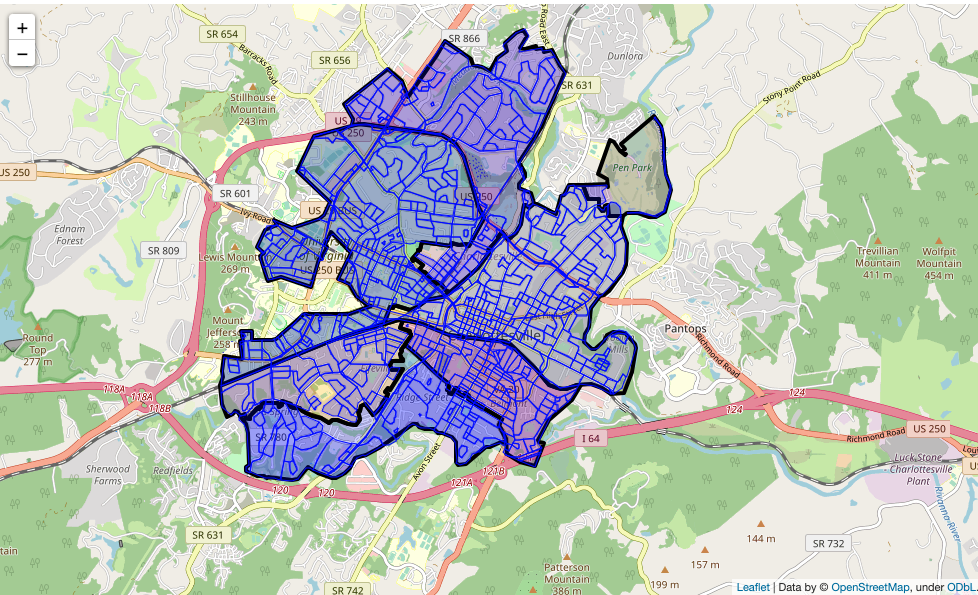
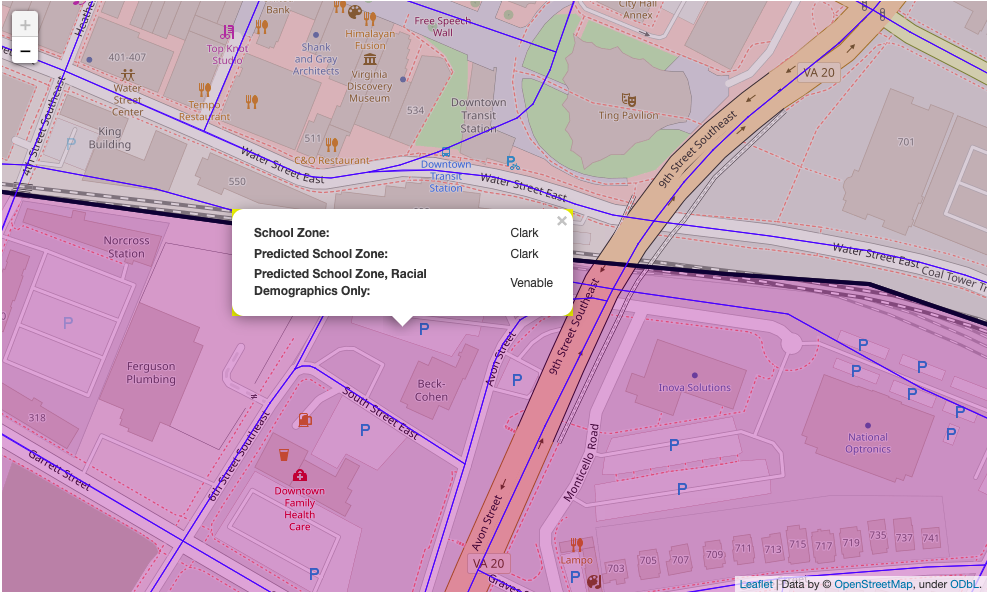

# Did We Really Desegregate?: Predicting School Zones with Demographic Data
## A model to determine how predictive demographic features are of elementary school zones

Charlottesville, Virginia, like every other town in the United States, has a checkered history with race relations and public education. The city school district has sought to remedy historic wrongs by updating its school zones and eliminating maps that were drawn to keep black kids out of historically white schools. This project looks at the current map and investigates the degree to which race still informs assigned school zone. Using census data about race, economic status, education levels, age spread, and details about housing, I was able to build a model that could predict a census block's assigned school district with 88.3% accuracy. My model that relied only on racial makeup predicted the correct school only 35.7% of the time, hardly better than a dummy model.
 

Photo by <a href="https://unsplash.com/@aaronburden?utm_source=unsplash&utm_medium=referral&utm_content=creditCopyText">Aaron Burden</a> on <a href="https://unsplash.com/photos/ob6O_xd67O0?utm_source=unsplash&utm_medium=referral&utm_content=creditCopyText">Unsplash</a>
 
<a href="https://github.com/LydiaCuffman/cville_school_zones">GitHub Repository</a>

<a href="https://github.com/LydiaCuffman/cville_school_zones/blob/main/presentation.pdf">Presentation</a>


## Business Understanding and Data Understanding

Charlottesville City Schools integrated under duress. Initially the superintendent closed the schools rather than integrate them. While the schools did eventually reopen and ostensibly integrate, what followed were decades of less overt segregation. <a href="https://www.nytimes.com/2018/10/16/us/charlottesville-riots-black-students-schools.html">The New York Times</a> reported on this history of discrimination against black students in a 2018 article. One illustrative example is Venable Elementary School, the school closest to the University of Virginia and the school cited in the article as having the highest test scores in the division. Students in a predominantly black neighborhood a half mile from the school were zoned for a school three miles away. That racist choice was only fully rectified in 2022, when the school board voted to adjust the school zoning map. The school division also issued an apology to community members for <a href="https://www.cvilletomorrow.org/after-half-a-century-bussing-kids-from-a-historically-black-public-housing-community-away-from-their-neighborhood-school-city-schools-votes-to-rezone-venable/">"historic and recent mistreatment."</a>

This project seeks to determine how equitable the new zoning map is. Now that an obviously racially motivated choice has been fixed, to what degree does the racial makeup of a neighborhood predict the elementary school its students are assigned to?

I used data from opendata.charlottesville.org as well as data collected by the Virginia Equity Center. Both data sets pull from the United States Census, but I found them easier to use than the direct Census Bureau portal. The Census breaks its data down on a variety of scales, with the smallest being block. I overlaid the Charlottesville City Schools elementary school zone map with the census blocks to build my data set. My racial data was at the block level and my other demographic details were at the block group level. My data about race showed the percentages of each racial group living in a Census block. My non-racial demographic data was largely focused on economic status, including features like median household income, percentage of population with health insurance, households receiving public health insurance and/or SNAP benefits, home-ownership rates, and the number of cost-burdened renters. Additionally I included the age breakdown of each block group along with details about number of housing units and how many of those units are vacant. 



## Modeling and Evaluation

I began with two dummy models. A model that randomly predicts one of the six elementary schools each time would be accurate 17.3% of the time. A model that always predicts the school that covers the most census blocks would be right 32.1% of the time.

After cleaning my data, I wrote a function that would allow me to easily compare the performance of each model I tried, as well as a function that will fit a model just to the best parameters from the grid search and also show a confusion matrix of its predictions. To make this notebook manageable, after running the grid searches, I commented them out and added a new cell that prints the grid search results and then runs the new model. I tried a logistic regression (with principal component analysis to address multicollinearity), a decision tree, a random forest, and a model using XGBoost. After running a grid search to avoid overfitting, I found that my XGBoost model performed the best, and it ultimately resulted in an accuracy score of 88.3% on testing data. This model suggests that demographic data can powerfully predict what school zone a block is in. Intuitively that makes sense, as neighborhoods are rarely heterogenous, especially with regards to income and related factors.

I removed all features that were not describing the racial makeup of the block and tried the same models. This time, the random forest with grid searched hyperparameters was the best model, but even it only predicted correctly 35.7% of the time on testing data. It appears that racial data alone is not very predictive of school zone.

Socioeconomic factors are often blamed in conversations about educational equity, so I was curious to see what happened if I constructed a similar model but with only the non-racial demographic data.  This last model looked at all of the demographic data aside from racial composition. Most of this data came from the Virginia Equity Center and was only available at the block group level, so I anticipated that less granularity might have an impact on how well the model would work. As this model was not directly related to the problem I was investigating, I didn't spend a lot of time iterating. I did a grid search on a random forest and an XGBoost model and then ran the testing data through the (slightly better) XGBoost model. Even with this limited iterative process and the less precise data, this model performed nearly as well as the full model, accurately predicting school zone in 87.8% of the testing data. 

It appears that you cannot say much about school zone based solely on race, but other demographic factors can be quite predictive.

After evaluating my best models, I used them to create an interactive map that showed each census block's true school zone as well as what the full and race-only models predicted.



## Conclusion

This model does not serve an immediate practical purpose, and it was never intended to. If someone wants to know their school district, the city schools division offers an address lookup tool that is always right.

Instead, this model is intended to encourage continued conversation. It appears that the school district has largely succeeded in drawing a map that is no longer explicitly racist. The map does still reflect a city dramatically divided by economic factors. These are not issues likely to be solved by redrawing the map, as they reflect the geography of housing in the city. If truly heterogenous schools were the ultimate goal, then students would have to travel all over town at random rather than attending their closest school. In addition to being a logistical nightmare, such a solution would surely be intolerable to the community.

The takeaway from this project is that the school map is no longer the place to direct our efforts towards increasing racial equity. School zoning was merely the first line of attack in efforts to tacitly keep schools segregated. While this project suggests that particular obstacle has been removed, the NYTimes article outlines many other areas of persistent discrimination, including access to advanced courses, gifted education, and a two-tiered diploma system. The public school system is no longer assigning students to schools in a directly racist way, but there's plenty of work still to be done.

## Next Steps

Our community's next steps are expansive, difficult, and vitally important. As to data science next steps, it might be worthwhile to revisit this process when more up-to-date data becomes available. The last three years have led to major shifts in many people's lives, and the human geography of Charlottesville could potentially have changed quite quickly in response. Additionally, I think the school division should pursue explorations of this type whenever zoning considerations come up, as they often do in the face of changing community needs.

This project points to other potential directions for investigation. Exploration of the different demographic compositions of each school zone could be instructive when discussing resource allocation within the school division. It seems clear that the economic background of students varies widely from school to school, and this sort of data analysis could help the division better serve the schools where students are most in need.

There are many private schools in Charlottesville, so it could be illuminating to investigate whether there is any geographic underpinning to which families opt out of public education. One would assume that economic factors correlate strongly with private education, but do geographic features correlate too? Answering such questions would require data I don't have, but that might be available to the school division. If there is a particular zone where more families are choosing to forgo their neighborhood school, that would be worth knowing. None of these models account for whether students in a block are actually attending their assigned public school, so the actual racial makeup of a student body might be easier to predict than my race-only model suggests. Obviously, getting the zoning map right is only one small step on the long road towards making the Charlottesville schools better integrated and a better experience for the full community.

## Repository Navigation
```
├──[data](data)
    ├──[regional_atlas_block_groups.csv](regional_atlas_block_groups.csv)
    ├──[cville_census_blocks.geojson](cville_census_blocks.geojson)
    ├──[cville_school_zones.geojson](cville_school_zones.geojson)
├──[images](images)
    ├──[swings.jpg](swings.jpg)
    ├──[school_zones](school_zones)
    ├──[school_zone_predictions](school_zone_predictions)
├──[.gitignore](.gitignore)
├──[LICENSE](LICENSE)
├──[README.md](README.md)
├──[predicting_cville_school_zones](predicting_cville_school_zones.ipynb)
└──[presentation](presentation.pdf)
```